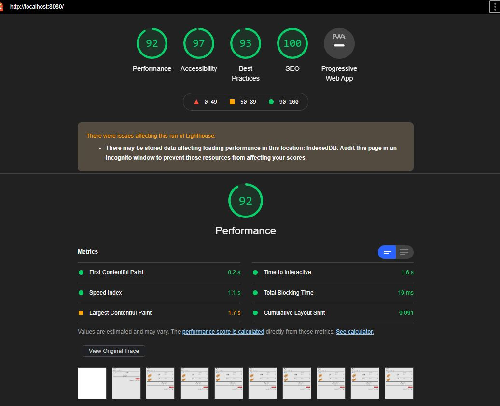

# Features
 * Responsiveness.
 * HTML is W3c compliant.
 * Accessablity enabled.
 * Props drilling avoided (Components are created using Composition techqnique).
 * Created using Webpack.
# Lighthouse score

### A typical top-level directory layout

    ├── src
            ├── Components
                        ├── AddToCartPageSummary.jsx
                        ├── Product.jsx
                        ├── ProductCostTable.jsx
                        ├── TotalSummary.jsx
            ├── Containers
                        └──Main.jsx
                        └──AddToCartPage.jsx 
            ├── styles
                     └──add-to-cart.scss
    └──.babelrc             #having env and react presets
    └── package.json
    └── README.md
    └── webpack.config.js   #having entry points and loader config
    └── index.js            #Root 
    └── index.html         
                 
    
# How to run
* Install the node modules using npm install.
* Run server using npm run start.
# Tools and Library used
1. React as JavaScript library
 * To attain resuablity.
 * Faster performance.
2. SASS as a preprocessor
 * To avoid redudancy of CSS.
3. Webpack as a Bundler
 * For bundling and to create dependency grapth of all the files in project.
4. Babel
 * As a transpiler for ES6 syntax.
5. Editor: Visual Studio Code
## Scope of Imporovement
1. Proptypes could have be added.
2. Sting literals could have put in Constants.
